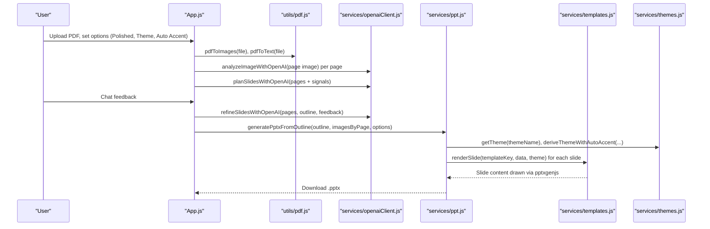
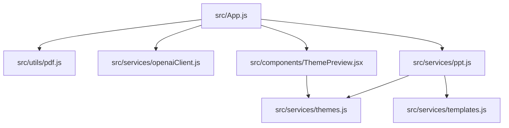
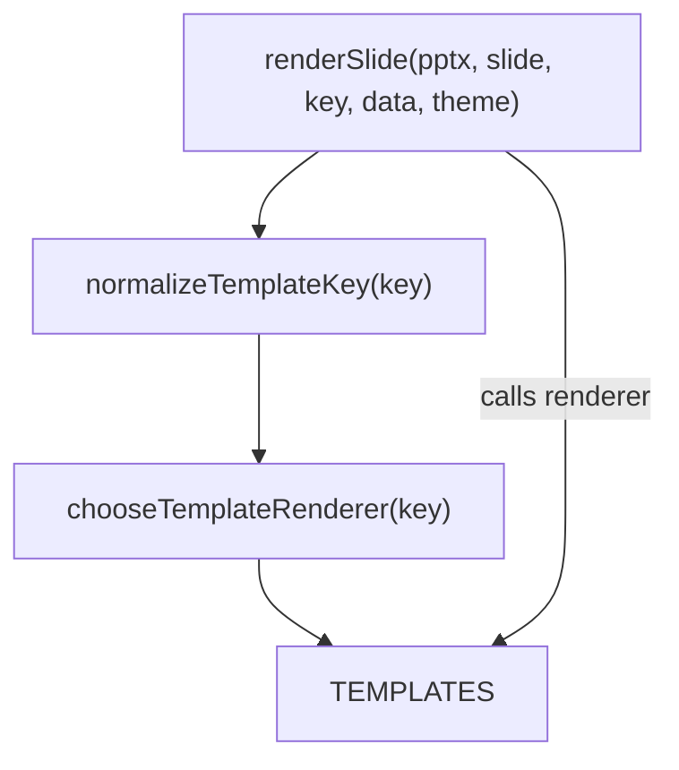
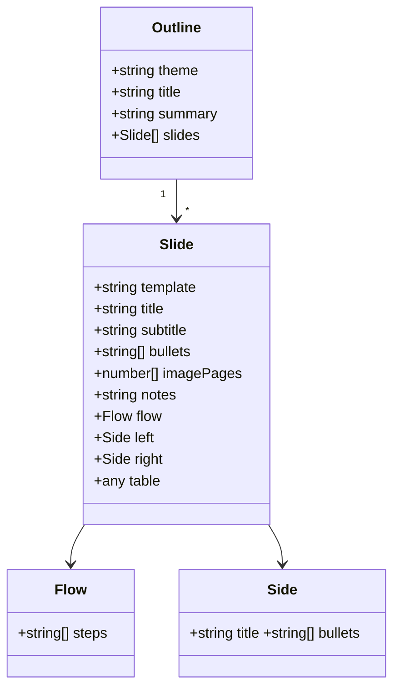

# pdf_to_ppt_frontend Architecture

This document describes the architecture of the pdf_to_ppt_frontend container. It covers the overall structure, core modules and their responsibilities, key design patterns, the data and theme flows, the template/rendering system, and how the system supports extensibility for features such as themes, tables, and nested bullets.

The codebase is a React single‑page app that runs entirely in the browser. It converts PDF pages to images and text, uses OpenAI to analyze content and plan slides, and generates a PPTX file locally via pptxgenjs, with rich theming and template support. No backend is required.

## Project structure

- src/App.js
  - Main UI and orchestration component. Handles PDF upload, extraction, analysis, chat, outline planning/refinement, and PPT generation.
- src/index.js
  - React entry point; renders App into the DOM.
- src/components/ThemePreview.jsx
  - Visual preview of the currently selected theme using the same tokens/styles the PPT export uses.
- src/services/openaiClient.js
  - Browser fetch client for OpenAI’s Chat Completions API with JSON‑first prompts, sanitation, and outline normalization utilities.
- src/services/ppt.js
  - PPTX generation utilities using pptxgenjs. Bridges outlines, themes, and template renderers to produce a downloadable PPTX.
- src/services/templates.js
  - Template registry and rendering functions for many slide layouts (title, bullets, image-left/right, two-column, flowchart, comparison, tables, split sections, asymmetric grids, etc.). Includes nested bullets support.
- src/services/themes.js
  - Theme registry ("azure", "midnight", "slate", "coral", "emerald", "minimal") with tokens for colors, typography, spacing, cards, and bullets. Includes helpers for contrast, auto-accent derivation, and consistent text styles.
- src/utils/pdf.js
  - PDF processing via pdfjs-dist: renders pages to images and extracts text with structural “chunks” (headings, lists, paragraphs, font sizes and bounding boxes).
- src/config/env.js
  - Client-side environment resolution for OpenAI API key. Supports build-time (.env) and runtime overrides (window.__RUNTIME_CONFIG__).
- Tests
  - src/services/ppt.themes.test.js validates theme application and template behaviors in PPT export.
  - src/components/ThemePreview.test.jsx validates the theme preview against theme tokens and contrast rules.

## High-level data flow

The app’s end-to-end flow is:

1) User uploads a PDF (drag-and-drop or file picker).
2) Client renders each page to an image (png data URL) and extracts text plus structured chunks (headings, lists, paragraphs).
3) For each page image, OpenAI is asked to decide “include?” and suggest a short title/caption.
4) The app compiles per‑page data and asks OpenAI to propose an outline of slides. Users can chat to refine the outline.
5) The app generates a PPTX locally via pptxgenjs using:
   - The outline content (titles, bullets, images, specialized blocks like flow/table/comparison)
   - A selected theme (optionally auto‑tuned accent color from images)
   - A layout/template engine that renders slide content with consistent spacing and styles
6) The PPTX is downloaded by the browser.

Sequence diagram of the main interactions:

## Core modules and responsibilities

- App.js
  - Manages UI state: pdfFile, extracted images/text, per‑page analysis, outline, chat history, theme selection, polished mode, autoAccent/strictStyles.
  - Orchestrates calls to:
    - utils/pdf.js for pdfToImages/pdfToText
    - services/openaiClient.js for per‑page analysis, outline planning/refinement, and chat
    - services/ppt.js for generatePptx or generatePptxFromOutline
  - Assembles imagesByPage and pageMeta to enrich the PPT generation step.
  - Provides users an option to do a “simple” generation without an outline (legacy/compat mode) or a “polished” generation with templates and themes.
- utils/pdf.js
  - Uses pdfjs-dist (CDN worker) to render PDF pages as images and to extract text.
  - Produces structured “chunks” with font sizes and classification heuristics (heading/list/paragraph) to inform the LLM’s outline planning.
- services/openaiClient.js
  - A thin fetch client to the Chat Completions API.
  - Provides robust prompts with response_format JSON preferences and fallbacks if unsupported.
  - Sanitizes and normalizes JSON-like responses; enforces schemas for per‑page analysis and outline structures.
  - Normalizes/fallbacks outlines to guarantee a viable deck: caps slides, fixes template names, ensures default theme, constrains bullet length/count, and builds a fallback outline from pages when needed.
- services/ppt.js
  - Creates a PptxGenJS instance and writes the deck.
  - Applies theme to slides (title slide and all content slides).
  - Infers templates when not provided based on slide content (images, bullets, table, comparison, flow).
  - Delegates to templates.js to render slide content.
  - Downloads the PPTX via writeFile or blob fallback for robust browser behavior.
- services/templates.js
  - A template registry and rendering system that converts normalized “slide data” into pptxgenjs calls.
  - Implements layouts: TITLE, TITLE_BULLETS, BULLETS, IMAGE_CARD, IMAGE_LEFT/RIGHT, TWO_COLUMN, FLOWCHART, QUOTE, COMPARISON, SECTION_DIVIDER (+_ANGLED), CHART, TABLE, SPLIT_SECTION (+image-left/right), ASYM_1_2, ASYM_2_1.
  - Provides a nested-bullets engine to generate correct pptx paragraphs with bullet, indent/indentLevel, per-level font sizes, and optional per-level bullet colors.
  - Adds “alternating backdrop” overlays to odd/even slides for a modern rhythm without mutating base slide background tokens (keeps theme tokens consistent).
- services/themes.js
  - Theme registry with design tokens: colors, typography, spacing, cards, bullets.
  - Contrast utilities (WCAG): ensure readable title/body/caption colors on any background.
  - Auto‑accent derivation: optionally computes an accent color from the first available image and validates contrast.
  - slideOptionsForTheme returns both “bkgd” and “background” for broad pptxgenjs compatibility.
- src/components/ThemePreview.jsx
  - UI component that previews a theme using the same style helpers used for PPT export (titleTextStyle/bodyTextStyle/captionTextStyle), plus chips for color tokens.
  - Helps users understand the aesthetic before generation; non‑functional to export logic.

Module-level dependency graph:

## Design patterns and architectural choices

- Registry pattern for templates and themes
  - templates.js exports TEMPLATES, a mapping from canonical keys (e.g., "TITLE_BULLETS") to renderer functions.
  - themes.js exports a THEMES registry and listThemes/getTheme/getThemeInfo.
- Strategy/dispatch for layouts
  - renderSlide dispatches by normalized template key and invokes the matching renderer.
  - inferTemplateKey in ppt.js chooses a template when the outline lacks one, based on available content (images, bullets, tables, flow).
- Defensive normalization and graceful degradation
  - openaiClient.js normalizes LLM responses to ensure there is always a usable outline (or constructs a fallback from PDF pages).
  - ppt.js tries pptx.writeFile first; if unavailable, falls back to writing a Blob and triggering a safe download.
  - templates implement fallbacks, e.g., TABLE will display a friendly message if addTable is not supported.
- Contrast-aware design
  - themes.js enforces contrast for text styles against background colors (WCAG-inspired), regardless of base tokens.
- Progressive enhancement
  - “Auto Accent” can derive a suitable accent from slide images (enabled by default), but can be locked via Strict Styles in the UI or disabled via options.

## Data and theme flow

- Inputs
  - PDF file (File object)
  - User options: polishedMode, themeName, autoAccent, strictStyles
  - Optional chat guidance and per-page analysis signals
- Extraction
  - pdfToImages: Array<{ page, dataUrl }>
  - pdfToText: Array<{ page, text, chunks?, stats? }>
- Planning and refinement
  - analyzeImageWithOpenAI(page image) -> { include, title, caption, rationale }
  - planSlidesWithOpenAI(pages with text and optional chunks, userGuidance) -> normalized outline
  - refineSlidesWithOpenAI(pages, existing outline, user feedback) -> normalized outline
- Generation
  - generatePptxFromOutline(outline, imagesByPage, deckTitle, options):
    - Theme selection: options.themeName overrides outline.theme; fallback “azure”
    - Optional autoAccent: deriveThemeWithAutoAccent(baseTheme, candidateImages)
    - For each slide: select template (explicit or inferred), build data, render via template function
    - Title slide added automatically using deck title
    - File is written and downloaded
- Theme tokens
  - colors: primary, secondary, accent, background, backgroundSoft, text, muted, border, white, black
  - typography: title, h1/h2, body, caption
  - spacing: page margins and gutter
  - cards: fill, line, shadow, shape
  - bullets: indentLevel (inches), bulletSize, bulletColor, and optionally per-level colors (bullets.colors[level])

## Template and rendering system

The template engine composes slides from normalized data and theme tokens via pptxgenjs primitives (addText/addImage/addShape/addTable).

Dispatch flow:

Supported templates (non-exhaustive):
- TITLE, TITLE_BULLETS, BULLETS
- IMAGE_CARD (single image with caption), IMAGE_LEFT, IMAGE_RIGHT
- TWO_COLUMN (two bulleted columns)
- FLOWCHART (single column or two-column serpentine connectors based on number of steps)
- QUOTE
- COMPARISON (left/right cards with titles and bullets)
- SECTION_DIVIDER and SECTION_DIVIDER_ANGLED
- CHART (image-backed or bullets fallback)
- TABLE (native addTable with header styling, graceful fallback)
- SPLIT_SECTION (+image-left/right variants), ASYM_1_2, ASYM_2_1

### Nested bullets and text handling

templates.js provides:
- normalizeBulletsInput: accepts strings, arrays (including nested arrays), or objects { text, children } and returns a uniform nested tree.
- paragraphsFromBullets: generates pptx-compatible paragraph pieces with:
  - bullet: true and per-level bulletColor
  - indent/indentLevel in inches to reflect nesting
  - per-level fontSize scaling
- renderBulletedText: dispatches nested paragraphs to slide.addText while applying bodyTextStyle(theme) and bulletListOptions(theme).

This guarantees nested bullet lists render correctly in PPT with clear visual hierarchy. Themes can optionally define bullets.colors[level] for per-level bullet colors; if absent, the default bullet color is used.

### Tables

The TABLE template accepts:
- { headers?: string[], rows: string[][] } or a simple string[][], with automatic header detection when headers are present.
- Adds a styled table with header fills and borders based on theme tokens. If the environment lacks addTable, it renders a helpful caption fallback.

### Flowcharts

The FLOWCHART template:
- Builds a vertical flow for <= 5 nodes.
- Uses a two-column serpentine layout for larger flows (e.g., 6–8 steps).
- Draws rounded rectangles (theme.cards.shape) and connectors with primary color arrows. Text is centered and sized via bodyTextStyle.

## Outline data model

The app converges on a normalized outline structure across planning and refinement steps:

Slides may also carry specialized blocks such as:
- flow: { steps: string[] }
- left/right: { title?: string, bullets?: string[] } for comparison layouts
- col1/col2 arrays for certain two‑column/asymmetric templates
- table input in object or 2D array form

## Extensibility

- Adding a new theme
  - Extend the THEMES registry in services/themes.js with a new builder.
  - Provide colors, typography, spacing, cards, and bullets tokens.
  - Optional: override bullets.colors[level] to tune per-level bullet colors.
  - ThemePreview will automatically support it via listThemes() and getThemeInfo().
- Adding a new template
  - Implement a renderer function in services/templates.js that calls pptxgenjs primitives using theme helpers.
  - Register the renderer in TEMPLATES with a canonical key.
  - Update normalizeTemplateKey to map friendly names (kebab/snake case) to your key.
  - Optionally, add inference logic in inferTemplateKey (services/ppt.js) to auto-select your template based on slide data.
- Nested bullets
  - Out-of-the-box support for nested bullet structures:
    - string, array, nested arrays, or objects { text, children } are normalized.
    - Theme bullets tokens control indent (in inches), bullet size, and color.
    - Optional per-level colors via theme.bullets.colors[level].
- Tables
  - The TABLE template supports header/body distinction and theme-driven header fill and border colors. It gracefully degrades with a message when addTable is unavailable.
- Images and accent color derivation
  - Auto Accent derives an accent color from the first available image. This can be disabled via options.autoAccent=false or UI “Strict Styles”.

## Environment and configuration

- Required environment variable for OpenAI:
  - REACT_APP_OPENAI_API_KEY
  - Compatibility: REACT_APP_REACT_APP_OPENAI_API_KEY is also supported to accommodate doubly-prefixed environments.
- env.js resolution order:
  1) window.__RUNTIME_CONFIG__.REACT_APP_OPENAI_API_KEY
  2) window.__RUNTIME_CONFIG__.REACT_APP_REACT_APP_OPENAI_API_KEY
  3) process.env.REACT_APP_OPENAI_API_KEY
  4) process.env.REACT_APP_REACT_APP_OPENAI_API_KEY
- Client-side keys are visible in the browser; use restricted keys and quotas for demos.

## Error handling and fallbacks

- OpenAI response_format fallbacks: If JSON response_format is rejected, the client retries without it and sanitizes/parses JSON-like content.
- Outline normalization: If the model output is missing or invalid, a minimal fallback outline is built from PDF pages to guarantee generation.
- PPTX download: If writeFile fails (e.g., blocked or unimplemented), code falls back to writing a Blob and triggering a download link.
- Table rendering: If pptxgenjs.addTable is unavailable (e.g., in certain test/mocked environments), the template shows a clear placeholder.

## Testing and verification

- ppt.themes.test.js
  - Ensures slide background tokens (bkgd/background) match selected themes.
  - Verifies title styling colors are derived via titleTextStyle(theme).
  - Validates that autoAccent=false bypasses accent derivation.
  - Confirms bullets options (bulletColor, bulletSize, indent/indentLevel) map from theme tokens.
  - Checks card tokens (fill/line/shadow/shape) in COMPARISON template.
- ThemePreview.test.jsx
  - Renders each theme and checks UI uses the same normalized tokens.
  - Confirms expected contrast ratios for title/body/caption relative to background.
  - Verifies accent divider and color chip labels match token hex values.

## Notes on UI and UX

- App.js exposes Polished Mode, Theme selection, Strict Styles (locks autoAccent), and Auto Accent toggle. Status/progress indicators prevent conflicting actions.
- ThemePreview helps users understand theme aesthetics; it mirrors the PPT’s text style helpers for accurate preview.

## Appendix: Key public interfaces

- pdf.js utilities
  - pdfToImages(file, maxWidth?): Promise<Array<{ page, dataUrl }>>
  - pdfToText(file, maxCharsPerPage?): Promise<Array<{ page, text, chunks?, stats? }>>
- OpenAI client
  - chatWithOpenAI(messages): Promise<string>
  - analyzeImageWithOpenAI(imageDataUrl, userContext?): Promise<{ include, title?, caption?, rationale? }>
  - planSlidesWithOpenAI(pages, userGuidance?): Promise<Outline>
  - refineSlidesWithOpenAI(pages, existingOutline, feedback): Promise<Outline>
  - formatOutlineForChat(outline): string
- PPT generation
  - generatePptx(slides, fileNameTitle, { themeName?, autoAccent? }): Promise<void>  // legacy/simple
  - generatePptxFromOutline(outline, imagesByPage, fileNameTitle, { themeName?, pageMeta?, autoAccent? }): Promise<void>
- Templates and themes
  - renderSlide(pptx, slide, templateKey, data, theme): void
  - chooseTemplateRenderer(key): (pptx, slide, data, theme) => void
  - listThemes(): string[]
  - getTheme(name): Theme
  - getThemeInfo(name): ThemeInfo
  - deriveThemeWithAutoAccent(baseTheme, imageDataUrls, { autoAccent?, minContrastBg? }): Theme
